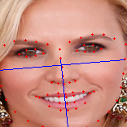

.. MaskImposer documentation master file, created by
sphinx-quickstart on Thu Aug  5 20:32:26 2021.
You can adapt this file completely to your liking, but it should at least
contain the root `toctree` directive.

Welcome to MaskImposer's documentation!
=======================================

.. toctree::
   :maxdepth: 4
   :caption: Contents:

   modules

Indices and tables
==================

* :ref:`genindex`
* :ref:`modindex`
* :ref:`search`

.. mdinclude:: ../../readme.md

Images in appearance order
==================

.. image:: ../.readme_media/68landmarks.png
.. image:: ../.readme_media/points.png

.. image:: ../.readme_media/example_res2.png

.. image:: ../.readme_media/example_res.png

