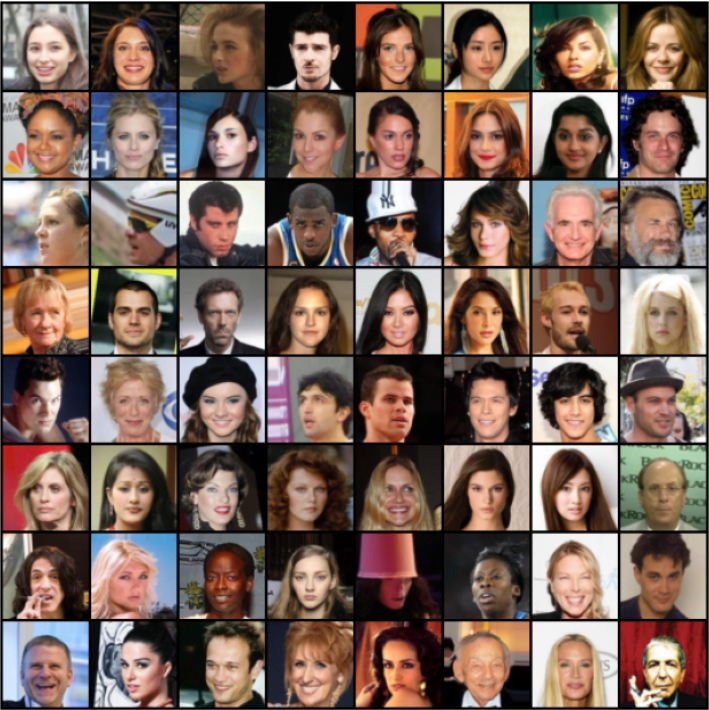
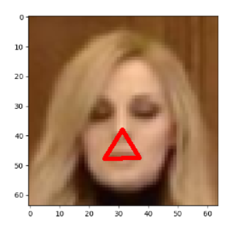

# mask-imposer
1. Install tensorflow/ pytorch and decide which one is better
    - I have worked few times with tensorflow, it seems to be `"more automated"`
    
2. Find image datasets with some landmarks cords. ([celebA](https://www.kaggle.com/jessicali9530/celeba-dataset))
3. Create custom dataset ( in pytorch dataset cooperates with dataloader)
    - Images have been transformed [centrally cropped (example below), resized to square 64x64 and normalized]
    

4. Learn a model `face_landmarks.pth` to find landmarks `[nose, mouth left, mouth right] cords
5. Using this model we can find cords of needed landmarks in unseen images. 
   By connection of above landmarks we construct a triangle. 
   

6. Triangle's bisectors intersection point may be the point in which we could paste a `face mask`

It is only an example of a `workflow`. Images may be cropped in other way. 

For example, we could exclude hair of people and focus straightly on face.
[images no hair](https://www.researchgate.net/figure/Examples-of-3-datasets-a-CelebA-dataset-after-aligning-b-fer2013-dataset-from-left-to_fig2_343778164)

## model 
#### todo
Use model from [link](https://arxiv.org/pdf/1406.4773.pdf) instead of provisional one.

## summary
I propose to find a dataset with a front face images ( celebA ) and insert fake masks on images.

- [biwi-kinect-head-pose-database](https://www.kaggle.com/kmader/biwi-kinect-head-pose-database)
## other datasets 
[not all checked yet]
- [kairos](https://www.kairos.com/blog/60-facial-recognition-databases)
- [Masked Face Recognition Dataset and Application](https://arxiv.org/pdf/2003.09093.pdf)
- [Real-World-Masked-Face-Dataset github](https://github.com/X-zhangyang/Real-World-Masked-Face-Dataset)
- [Masked Face Recognition Dataset](https://medium.com/the-programming-hub/wolrds-most-complete-masked-face-recognition-dataset-is-for-free-10d780eed512)

