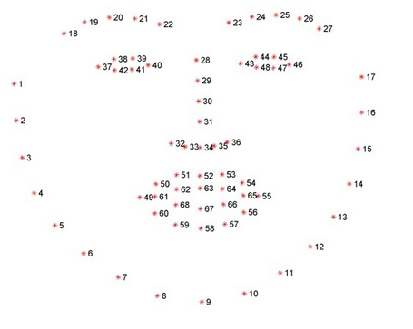
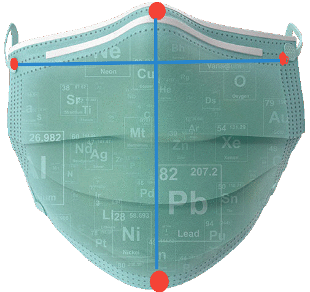
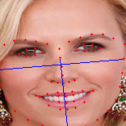

# Mask imposer 😷

Tool to overlay fake face masks.

## Table of contents

- [Introduction](#introduction)
- [General](#general)
    - [Inspection](#input-inspection)
    - [Imposion](#imposion)
    - [Detection](#detection)
- [Installation](#installation)
- [Usage](#usage)
    - [Options](#options)
    - [Workflow](#workflow)

## Introduction

Mask imposer is a tool for overlaying face mask over human central faces.

Application main purpose is to allow users to make fake datasets of people in face masks. Since there is no available
free dataset, application is useful in machine or deep learning in classification/ recognition problems.

## General

`How it works?`

### `Input inspection`

At the beginning program reading images from given input directory and validates images.

### `Detection`

Program detects 68 landmarks using some simple model
found [here]("http://dlib.net/files/shape_predictor_68_face_landmarks.dat.bz2").



For now program requires only 4 of them:

- left - _2_
- right - _16_
- top - _29_
- bottom - _9_

### `Imposion`

As stayed in [previous paragraph](#detection) program use only few landmarks.

After landmarks have been detected, program reading mask image with some hardcoded coordinates (X,Y) responding to all
indexes stated in [previous paragraph](#detection).


Red dots are points responding to left, right, top and bottom landmark defined in [previous paragraph](#detection).

In next state program computes distances between opposite dots in vertical and horizontal way.



As almost last step program scales mask until above distances are equal to responding distances between landmarks found
in target image.



For now protruding part of the face mask is being cut and result is saved in output directory (default=`results`).


## Installation

```shell
pip install git+https://github.com/sqoshi/mask-imposer.git
```

## Usage

```
mim INPUT_DIR --option argument
```

### Options

| Option | Required | Default | Description |
|:----:|:----:|:----:|:----:|
| input_dir | ✔️ | -- | Input directory. |
| --output-dir | ❌ | results | Output directory. |
| --output-format | ❌ | png | Output images format. |
| --shape-predictor | ❌ | None | Path to shape predictor. |
| --show-samples | ❌ | False | Show sample after detection. |
| --draw-landmarks | ❌ | False | Draw circles on detected landmarks cords. |
| --detect-face-boxes | ❌ | False | Before landmark prediction detect face box. |

### Workflow

1. Prepare images with center faces. Face zoom improves the results quality.

   

2. Move images to directory and pass it via below command.
    ```
    mim input_directory
    ```

3. Check out results stored as default in `results` directory under current directory.

   


