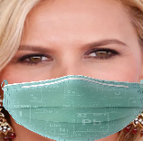

# Mask imposer 😷

Tool to overlay fake face masks.

Project is a part of series related with my Bachelor of Science Thesis research.

## Table of contents

- [Introduction](#introduction)
- [General](#general)
    - [Inspection](#input-inspection)
    - [Imposition](#imposition)
    - [Detection](#detection)
        - [Important landmarks](#important-landmarks)
    - [Imposition](#imposition)
- [Installation](#installation)
- [Usage](#usage)
    - [Options](#options)
    - [Custom mask](#custom-mask)
    - [Workflow](#workflow)
- [Documentation](#documentation)

## Introduction

Mask imposer is a tool for overlaying face mask over human central faces.

Application main purpose is to make fake datasets of people in face masks. Since there is no available free dataset,
application is useful in machine or deep learning in classification/ recognition problems.

## General

`How it works?`

### `Input inspection`

At the beginning program reading images from given input directory and validates images.

### `Detection`

Program detects 68 landmarks using some simple model
found [here]("http://dlib.net/files/shape_predictor_68_face_landmarks.dat.bz2").


#### Important landmarks

For now program requires only 4 of them:

- `left` - _2_
- `right` - _16_
- `top` - _29_
- `bottom` - _9_

### `Imposition`

When landmarks have been detected, program is reading mask image with some hardcoded coordinates (X,Y) responding to all
indexes mentioned in [previous paragraph](#important-landmarks).


Red dots are points responding to *left*, *right*, *top* and *bottom* landmark defined
[here](#important-landmarks).

In next state program computes distances between opposite dots in vertical and horizontal way.


As almost last step program scales mask until above distances are equal to responding distances between landmarks found
in target image.


For now protruding part of the face mask is being cut and saved in output directory (default=`results`).



## Installation

```shell
pip install git+https://github.com/sqoshi/mask-imposer.git
```

## Usage

```
mim INPUT_DIR --option argument
```

### Options

| Option | Required | Default | Description |
|:----:|:----:|:----:|:----:|
| input_dir | ✔️ | -- | Input directory. |
| --output-dir | ❌ | results | Output directory. |
| --output-format | ❌ | png | Output images format. |
| --shape-predictor | ❌ | None | Path to shape predictor. |
| --show-samples | ❌ | False | Show sample after detection. |
| --draw-landmarks | ❌ | False | Draw circles on detected landmarks coords. |
| --detect-face-boxes | ❌ | False | Before landmark prediction detect face box. |
| --use-bundled-mask | ❌ | 1 | Program offers some bundled (default) masks, choices (1,2) |
| --mask-coords | ❌ | None | Custom mask characteristic `[2,9,16,29]` landmarks coordinates json filepath. |
| --mask-img | ❌ | None | Custom mask image filepath. |

### Custom Mask

Mask maybe inputted via terminal by using flag `--mask-img`. Then mask image popup on the screen and program asks user
to interactively mark characteristic points on displayed image.

If flag `--mask-img` would be combined with `--mask-coords` then characteristic points will be read from inputted
filepath.

Using custom mask requires inputting a _path to mask image_ or _path to mask image and a path to json
with [important landmarks](#important-landmarks)_.

Image requirements:

- Mask must fit image size as much as only possible.
- Mask image must have not got background. Background maybe removed simply by online tools
  like [removebg](https://www.remove.bg/)

Example:


Coordinates file requirements:

- Keys must match [important landmarks](#important-landmarks)
- Values must be a 2-elements list and respond to `(X, Y)` order.
- Point (0,0) is in left top corner of image.

Example `mask_coords.json`:

```json
{
  "2": [
    15,
    50
  ],
  "9": [
    185,
    310
  ],
  "16": [
    365,
    50
  ],
  "29": [
    185,
    20
  ]
}
```

### Workflow

1. Prepare images with center faces. Face zoom improves the results quality.

   

2. Move images to directory and pass it via below command.
    ```
    mim input_directory
    ```

3. Check out results stored as default in `results` directory under current directory.

   

## Documentation

Generation:

```
1. nano docs/source/conf.py && cd docs 
2. sphinx-apidoc -o source ../mask_imposer
3. make html
```

Local usage:

```shell
cd docs
make html
```